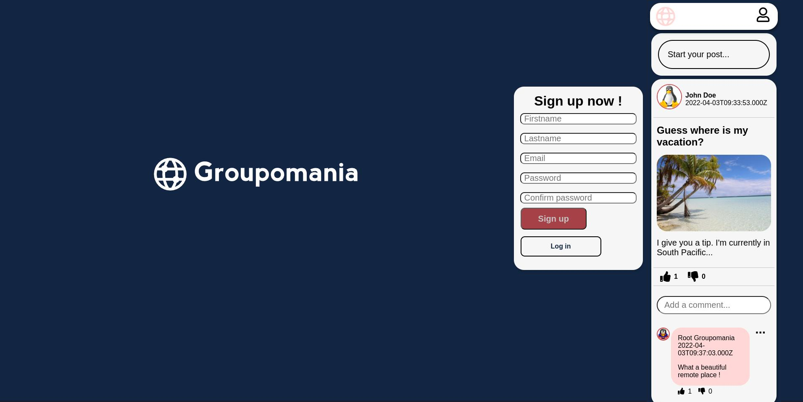

MartinBinard_7_02122021
**Projet 7**

**_GROUPOMANIA - A private social network using VueJS 3, nodeJS, express, MySQL & Sequelize_**

**Main branch - Commit #106**

# Description

- This website is a project to web developer course teached by [Openclassroom](https://openclassrooms.com/en/paths/141-web-developer)
- Build a full-stack private social network for a company called Groupomania.
- The entire project is made from scratch, only logos are delivered.
- :warning: A new front-end made with Quasar is in progress. :construction:

# Watch on Youtube

[](https://www.youtube.com/watch?v=3EP2cDBHx0U "Watch Groupomania on Youtube")

# Main goals

- A new frontend is being build with Quasar ( VueJS 3, VueX ). :construction:
- The backend is made with NodeJS, Express with MySQL database & Sequelize as ORM.

# Change done

- Add default Tux avatar.

# Before to run this server

- :warning: In a terminal, create your own MySQL database, named `groupomania` by default with `root` user & `azerty` password.
- In the root of the `/backend` folder, rename the folder called `/images.example` to `/images`.
- Rename `.env.example` into `.env` files loacted for each frontend & backend folder.
- In a terminal with MySQL, insert this query:

```
CREATE DATABASE groupomania;
```

- In the .env backend file, insert your parameters :

```
DB_NAME = INSERT DATABASE NAME
DB_USER = INSERT DATABASE USER
DB_USER_PASSWORD = INSERT DATABASE USER PASSWORD
DB_HOST = INSERT DATABASE HOST
DB_DIALECT = mysql
DB_PORT = 3306
APP_PORT = 3001

USER_CRYPTOJS_KEY = INSERT RADOM ASCII CHARACTER
SECRET_TOKEN = INSERT RANDOM ASCII CHARACTER
NODE_ENV = development
```

- In the .env frontend file, insert your parameters:

```
VUE_APP_API_PORT = 3001
```

- :warning: VUE_APP_API_PORT value must be equal to APP_PORT one.

# How to run this application

- Open terminal in both frontend and backend repos, then run the following commands :

- Install depedencies :

```
npm install
```

- Launch frontend-quasar separately if you want to test the new frontend application :construction: :

```
npm run dev
```

- Then open this link: [http://localhost:8080/submit](http://localhost:8080/submit) in your favorite browser.

- :warning: In order to prevent from port collisions, the API code port value is 3001, the data base port value is 3306 by default and the frontend port value is 8080.

# How to create an admin user with root privileges :crown:

- In the dabase named `groupomania` by default insert this query with the desired user_id :

```
UPDATE `users` SET `admin` = '1' WHERE `user_id` = '1';
```
